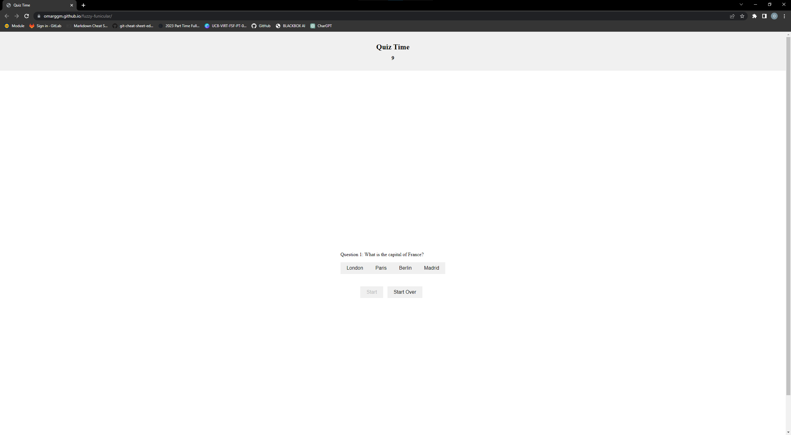

# Quiz Time Application
Welcome to the Quiz Time Application! This is a simple web-based quiz that tests your knowledge on various topics. The application presents multiple-choice questions to the user and provides instant feedback on the correctness of the answers. It also calculates the score based on the number of correct answers and the remaining time.

## Features
- Countdown Timer: The application features a timer that counts down from 60 seconds. If the timer reaches zero before the user completes the quiz, it displays "Time's Up!" and calculates the final score.
- Multiple Questions: The application includes a set of predefined questions with multiple choices. Each question has one correct answer, and the user selects their answer by clicking on the corresponding button.
- Instant Feedback: After selecting an answer, the application provides immediate feedback on whether the choice was correct or incorrect. For incorrect answers, the timer is deducted by 10 seconds.
- Score Calculation: At the end of the quiz, the application calculates the score based on the remaining time. Each correct answer contributes to the score, while incorrect answers result in a time penalty.
- High Scores: The application allows users to enter their initials at the end of the quiz and records their scores. It displays a list of high scores, sorted in descending order, including the initials, score, and number of correct answers. The top 5 scores are saved in the browser's local storage.
## Technologies Used
The Quiz Time Application is built using the following technologies:

- HTML: The structure and layout of the web page are defined using HTML.
- CSS: CSS is used to style the HTML elements and create an appealing visual design.
- JavaScript: The application logic and interactivity are implemented using JavaScript. It handles the timer, question display, answer checking, score calculation, and high score management.
## Getting Started
To use the Quiz Time Application, follow these steps:

1. Clone the repository
2. Open the index.html file in a web browser.
3. The quiz will start automatically when you click the "Start" button.
4. Read each question and click on the button corresponding to your chosen answer.
5. After answering all the questions or when the timer runs out, the final score will be displayed along with the option to enter your initials.
6. You can view the high scores by clicking the "Start Over" button after completing the quiz.

## Usage 

[Quiz Time](https://omarggm.github.io/fuzzy-funicular/)

## Customization
If you want to customize the quiz, you can modify the following:

- Questions and Choices: Open the script.js file and update the questions array with your own questions, choices, and correct answers.
- Timer Duration: In the script.js file, adjust the timer variable to set a different duration for the countdown timer.
## Compatibility
The Quiz Time Application is compatible with modern web browsers, including Chrome, Firefox, Safari, and Edge. It requires JavaScript to be enabled.

## License
This project is licensed under the MIT License. Feel free to use and modify the code as per the license terms.

Copyright 2023

Permission is hereby granted, free of charge, to any person obtaining a copy of this software and associated documentation files (the “Software”), to deal in the Software without restriction, including without limitation the rights to use, copy, modify, merge, publish, distribute, sublicense, and/or sell copies of the Software, and to permit persons to whom the Software is furnished to do so, subject to the following conditions:

The above copyright notice and this permission notice shall be included in all copies or substantial portions of the Software.

THE SOFTWARE IS PROVIDED “AS IS”, WITHOUT WARRANTY OF ANY KIND, EXPRESS OR IMPLIED, INCLUDING BUT NOT LIMITED TO THE WARRANTIES OF MERCHANTABILITY, FITNESS FOR A PARTICULAR PURPOSE AND NONINFRINGEMENT. IN NO EVENT SHALL THE AUTHORS OR COPYRIGHT HOLDERS BE LIABLE FOR ANY CLAIM, DAMAGES OR OTHER LIABILITY, WHETHER IN AN ACTION OF CONTRACT, TORT OR OTHERWISE, ARISING FROM, OUT OF OR IN CONNECTION WITH THE SOFTWARE OR THE USE OR OTHER DEALINGS IN THE SOFTWARE.

## Acknowledgements
The Quiz Time Application was developed by Omar Garcia. It was created as a practice project to demonstrate basic HTML, CSS, and JavaScript skills. Feel free to use and modify it for your own purposes.
